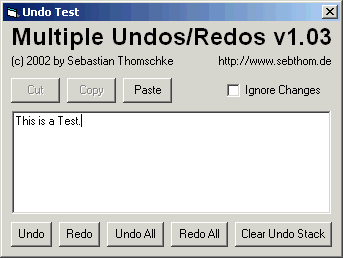

<div align="center">

## Professional Multiple Undos Class for RichTextBoxes v1\.03 \[UPDATED 05/01/2002\]


</div>

### Description

I've tried a lot of different multiple undo examples from the Inet, but every had at least one draw back. So I had to write my on solution and I think this one is quite smart. If you want to use it, you don't have to clutter your code by pasting in lots of undo-related subs, functions and variables. Everything comes within two handy class files and you only need to add three lines of code to your VB projects. -- I didn't test the code on VB5.0, would be cool if anybody can give a feedback on that. -- NEW: a single undoitem now stores only the modifications and not the whole text --> that is important when working with bigger files. -- NEW: now you can turn off the automatical tracking of text changes --> may be useful on automated text operations. -- NEW: Speed improvements. New properties getUndoCount and getRedoCount. Now you can undo/redo multiple changes with one function call. -- Thanks to MrBobo for his ideas and suggestions. -- -- Have a look at the latest version supporting standard textboxes too: http://www.planet-source-code.com/vb/scripts/ShowCode.asp?txtCodeId=34335&lngWId=1
 
### More Info
 


<span>             |<span>
---                |---
**Submitted On**   |2002-05-02 09:31:08
**By**             |[x\-treme](https://github.com/Planet-Source-Code/PSCIndex/blob/master/ByAuthor/x-treme.md)
**Level**          |Intermediate
**User Rating**    |5.0 (85 globes from 17 users)
**Compatibility**  |VB 6\.0
**Category**       |[Miscellaneous](https://github.com/Planet-Source-Code/PSCIndex/blob/master/ByCategory/miscellaneous__1-1.md)
**World**          |[Visual Basic](https://github.com/Planet-Source-Code/PSCIndex/blob/master/ByWorld/visual-basic.md)
**Archive File**   |[Profession78405522002\.zip](https://github.com/Planet-Source-Code/x-treme-professional-multiple-undos-class-for-richtextboxes-v1-03-updated-05-01-2002__1-34094/archive/master.zip)

### API Declarations

```
Private Declare Function SendMessage Lib "user32" Alias "SendMessageA" _
(ByVal hWnd As Long, ByVal wMsg As Long, ByVal wParam As Long, lParam As Any) As Long
Private Declare Function InvalidateClientRect Lib "user32" Alias "InvalidateRect" _
(ByVal hWnd As Long, ByVal lpRect As Long, ByVal bErase As Long) As Long
Private Const WM_SETREDRAW = &HB
'These API declarations are only used for
'the example and not part of the undo
'class itself:
Private Declare Function SendMessage Lib "user32" Alias "SendMessageA" _
(ByVal hwnd As Long, ByVal wMsg As Long, ByVal wParam As Long, lParam As Any) As Long
Private Const WM_CUT = &H300
Private Const WM_COPY = &H301
Private Const WM_PASTE = &H302
```


